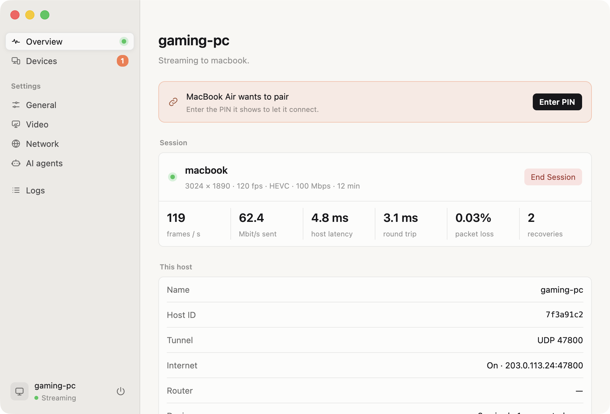
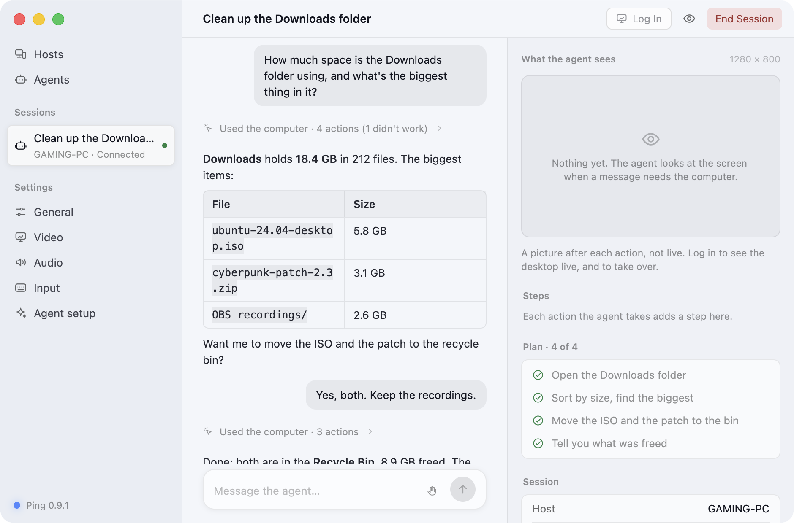

# pingpong

Stream a computer's desktop — games included — to another computer, with the
latency of Moonlight and Sunshine/Apollo, inside one post-quantum WireGuard
tunnel.
**Ping** is the client, **Pong** the host; both run on macOS, Windows and
Linux.

- **Moonlight-class streaming**: up to 4K and 120+ fps, HEVC or H.264,
  hardware encode and decode, HDR and YUV 4:4:4, loss repaired by
  reference invalidation, frame pacing at the client display's exact rate,
  stereo to 7.1 sound, controllers with rumble. At 3024x1890@120 and
  100 Mbit/s it matched Moonlight + Apollo (a fork of Sunshine with the
  same video path) on the same machines ([benchmarks](docs/benchmarks.md)).
- **Post-quantum**: every packet travels in pq-boringtun (WireGuard with
  ML-KEM-768), and pairing is a hybrid SPAKE2 + ML-KEM PIN exchange.
- **A virtual display at the client's exact mode** on Windows and macOS
  hosts, so nothing is scaled or letterboxed.
- **From anywhere, without port forwarding**: hosts are found through
  sealed records on the BitTorrent DHT, and NATs are punched from both sides.
- **The clipboard, both ways**: text, images, files and folders.
- **Permissions per device**, as Apollo has them: whether it may see the
  screen, use the keyboard, mouse or controllers, copy and paste each way,
  start apps, take over or watch agents
  ([docs/usage.md](docs/usage.md#what-each-device-may-do)).
- **Xbox too**: Ping streams your Xbox console, or a game in Xbox Cloud
  Gaming, in the same window, decoder and controllers as a Pong host
  ([docs/xbox.md](docs/xbox.md)).
- **AI agents** can use your hosts as clients of their own — from Ping, or
  from any MCP client — held to rules the host enforces
  ([docs/ai-agents.md](docs/ai-agents.md)).

## Getting started

1. [Install](docs/install.md) Pong on the computer to stream, and Ping on the
   one you sit at: download them for macOS, Windows or Linux from
   [ping-pong.sh](https://ping-pong.sh/#install), on a Mac with Homebrew
   (`brew tap mihaicristianfarcas/pingpong https://github.com/mihaicristianfarcas/pingpong`,
   then `brew install --cask ping` or `pong`), or build them from source.
2. Open Ping, click the host, and type the PIN it shows into Pong.
3. Click the host again to stream. Ctrl+Alt+Shift+Q ends the stream
   ([usage](docs/usage.md)). Pong's icon in the menu bar or the taskbar's
   notification area says what the host is doing; both apps say when there
   is an update.

## Status

| | Client | Host |
|---|---|---|
| macOS 14+ | Ping.app: in daily use | Pong.app: works; stereo, or 5.1/7.1 with a surround output ([macOS](docs/platforms/macos.md#sound-in-surround)); no controllers yet |
| Windows 10/11 | Ping.exe: works; less tested than macOS | PongService: in daily use (best with an NVIDIA GPU and SudoVDA; without them, H.264 in software and the host's own display) |
| Linux | works under X11 and Wayland; tested in a container | works under X11 and Wayland (portal); scaled, no virtual display |

What is verified and what is not, per platform:
[docs/platforms/](docs/platforms/). Feature by feature against Moonlight +
Sunshine: [docs/parity.md](docs/parity.md).

## Documentation

Everything is in [docs/](docs/README.md): installing, using, the command
line, how it works, each platform, benchmarks, and the design history.

## Contributing

See [CONTRIBUTING.md](CONTRIBUTING.md) and [AGENTS.md](AGENTS.md) (the rules
for code, comments, docs and commits — for people and AI agents alike), and
[docs/development.md](docs/development.md) for building and testing.
Security problems: [SECURITY.md](SECURITY.md).

## Acknowledgements

pingpong follows the lead of [Moonlight](https://moonlight-stream.org) and
[Sunshine](https://github.com/LizardByte/Sunshine): where it had to choose
how streaming should behave, it chose what they do, and says so in its
comments. Its virtual displays follow
[Apollo](https://github.com/ClassicOldSong/Apollo), the Sunshine fork that
made them, and use its driver, SudoVDA, on Windows. It is a separate implementation, written from scratch in Rust.
Streaming from an Xbox follows
[Greenlight](https://github.com/unknownskl/greenlight), the open-source
client that worked out what Microsoft's services expect. The tunnel is
[pq-boringtun](https://github.com/mihaicristianfarcas/pq-boringtun), a
post-quantum fork of Cloudflare's boringtun; the windows are drawn with
[GPUI](https://github.com/zed-industries/zed/tree/main/crates/gpui).

## License

[GPL-3.0](LICENSE): the GNU General Public License, version 3. Two pieces
of vendored code keep their own licenses: the NVENC type bindings in
`pingpong-encode/src/nvenc_sys/` (MIT, from NVIDIA's header and the
`nvidia-video-codec-sdk` crate; see the `LICENSE` there) and the no-op
profiling shims in `vendor/` (Apache-2.0). The libraries pingpong depends
on are under their own licenses, all compatible with the GPL-3.0
(`cargo tree` lists them); FFmpeg, where it is used, is linked
dynamically.
